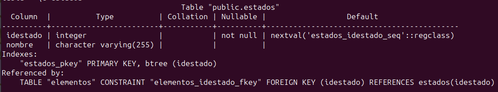

# Práctica JDBC 

Este proyecto consiste en un sistema de gestión de base de datos para la Tabla Periódica, centrado en la información de elementos químicos, series y estados.

## Requisitos
- Java 8 o superior
- Base de datos PostgreSQL instalada y configurada
##  Ejecución

1. **Configuración de la Base de Datos**

   - Crea una base de datos en PostgreSQL para el proyecto.
   - Actualiza la configuración de conexión en: `LigaACB/src/db.properties`.

2. **Ejecutar el proyecto**
    
    - Ejecuta el archivo: `LigaACB/src/TablaMain.java`.
    
3. **Utilizar el Programa**

    - Sigue las instrucciones en la consola para interactuar con el sistema de gestión de base de datos.
    - Puedes realizar operaciones como la creación de tablas, lectura desde archivos CSV y consultas personalizadas.
## Estrategia Utilizada

- El proyecto utiliza Java con JDBC para interactuar con la base de datos PostgreSQL.
- Se han implementado controladores específicos (SerieController, EstadoController, ElementoController) para gestionar las entidades de la Tabla Periódica.
- La lectura desde archivos CSV se realiza utilizando la biblioteca OpenCSV para garantizar un manejo eficiente de datos.
- El sistema proporciona información detallada en la consola para guiar al usuario durante la ejecución.

## Diseño Tablas

**Tabla elementos**

**Tabla series**

**Tabla Estados**

